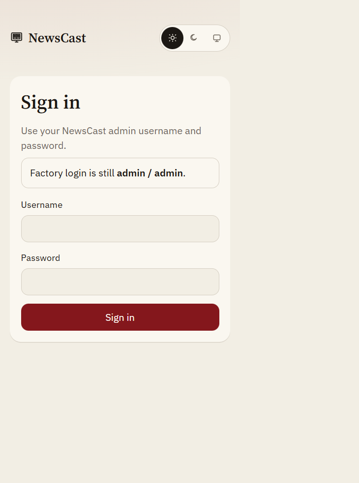
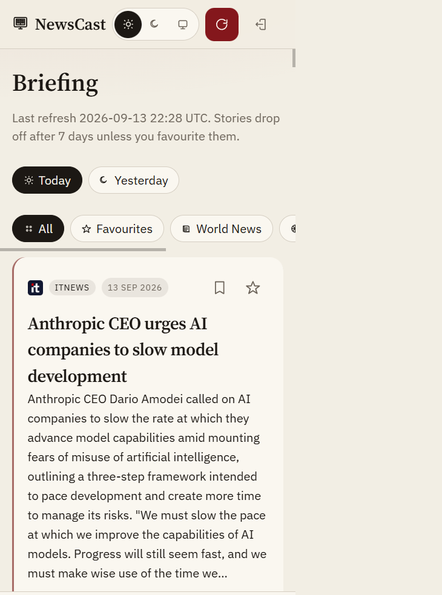
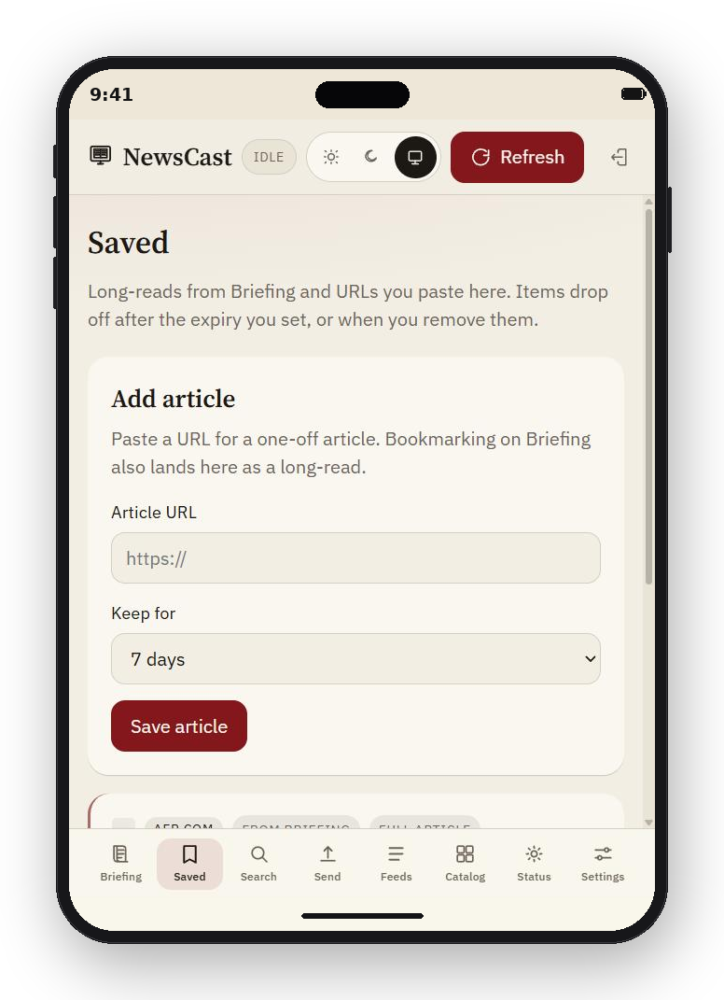
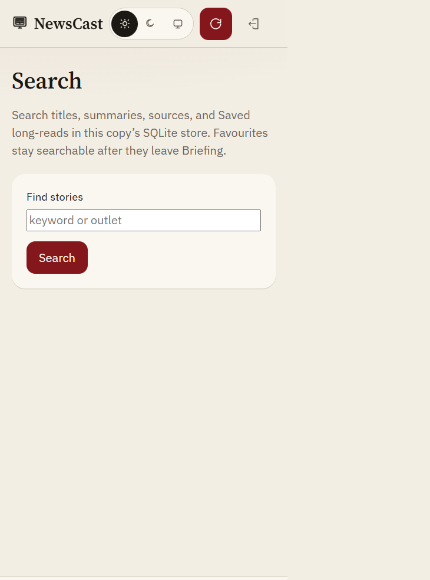
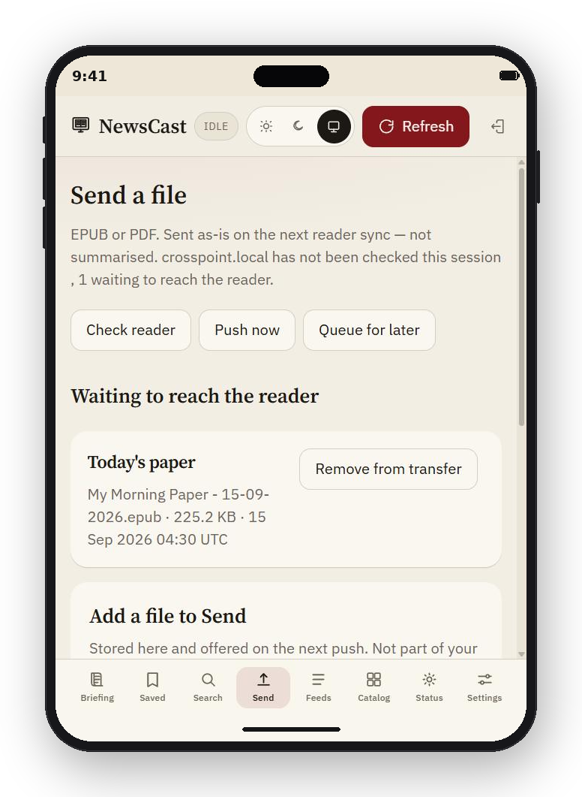
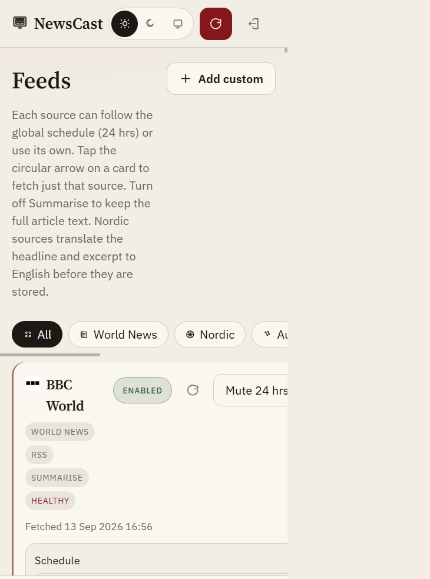
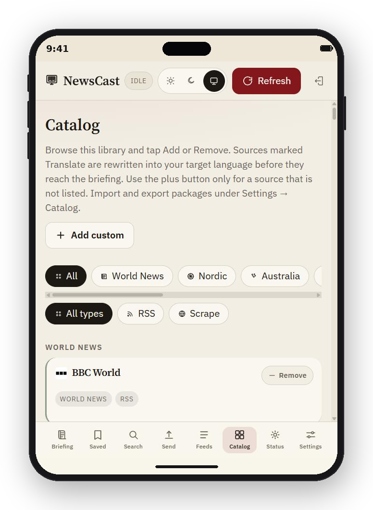
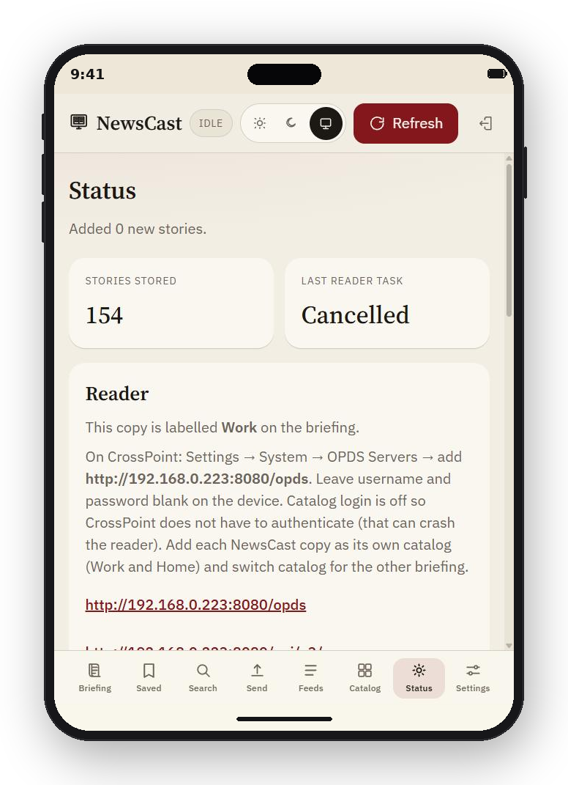
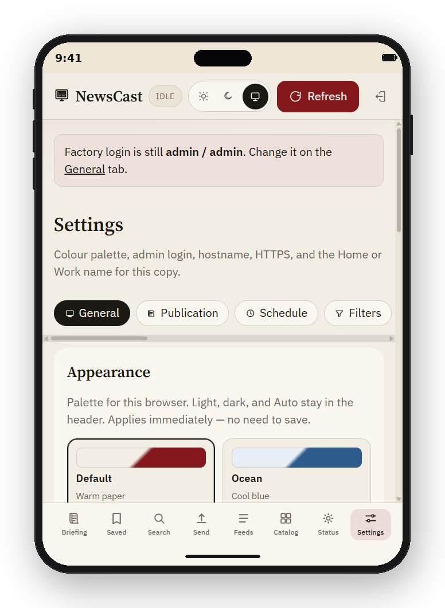

# NewsCast

A Python news aggregator for a home Raspberry Pi or a Windows machine on your LAN. It fetches the sources you choose, writes a short briefing, and sends that briefing to an e-reader.

The intended reader path is **CrossPoint** over OPDS. A Sync-style API is still there for patched Xteink firmware.

Default login: **admin** / **admin** on the in-page sign-in screen. Change it on Settings after first launch.

<p align="center">
  
</p>

## What it does

- Fetches RSS on a schedule, or scrapes a website when no usable RSS is found
- Deduplicates the same story across outlets
- Writes a concise briefing (OpenAI or a local Ollama model; otherwise extracted text)
- Stores stories in SQLite and drops unfavourited ones after 7 days
- Serves a mobile-first web UI on the LAN (light, dark, or match the device)
- Caches each publication’s icon when a source or saved article is added
- Exposes an OPDS catalog for CrossPoint, plus JSON / TXT / EPUB briefing downloads
- Queues EPUB or PDF files as-is for the next reader sync (not summarised)

## Web UI

| Tab | What it is for |
| --- | --- |
| **Briefing** | Today or Yesterday, category filters, a star to keep a story past expiry, and a bookmark to save it as a long-read |
| **Saved** | Paste a one-off article URL. NewsCast scrapes the full text, keeps it for 7 days or a date you pick, and includes it in the next briefing |
| **Search** | Find stories, favourites, and Saved long-reads in the SQLite store |
| **Send** | Upload an EPUB or PDF. Check the reader when you want, then push now or queue until it is on Wi-Fi |
| **Feeds** | Your sources: Enabled / Disabled, mute for 24 hours, health badge, Global vs Custom schedule, keywords, Summarise vs Full article, Translate to English, and Add custom |
| **Catalog** | Browsable library of World News, Nordic, Australia, culture, tech, science, and other sources. Import or export a JSON package of providers. Nordic feeds translate to English before they are stored. Tap Add; use plus only for a source that is not listed |
| **Status** | Ingest health, last reader task, Check reader plus push controls, OPDS / briefing links, a note when a GitHub update is available, and a QR code to open or add this copy on an iPhone home screen (NewsCast Home, NewsCast Work) |
| **Settings** | Tabs for Device (including colour palettes), Schedule, Filters (include/exclude words), LLM, Reader (catalog login and CrossPoint push), Categories, Backup/Restore, Update, and About |

<p align="center">
  
  
  
  
  
  
  
  
</p>

Refresh in the header fetches every enabled source now. A background tick every minute only fetches sources that are due. Sources set to Global follow the Settings interval; Custom sources keep their own.

## Windows development

```powershell
python -m venv .venv
.\.venv\Scripts\Activate.ps1
pip install -r requirements.txt
copy .env.example .env
```

Double-click `run-local.bat` (or run it from a prompt). It stops anything already listening on the NewsCast port, then starts the server. Open http://127.0.0.1:8080 and sign in with `admin` / `admin`. Port 8000 is often taken on Windows (for example uniFLOW SmartClient), so NewsCast defaults to 8080.

## Raspberry Pi OS

Step-by-step for a fresh Pi (USB copy, no technical background): see **[INSTALL.md](INSTALL.md)**.

You do not need the whole repo (no `.venv`, tests, or Windows data). On the PC, double-click `deploy\export-pi.bat`. It writes a slim folder at `dist\NewsCast-pi`. Copy that onto the Pi (USB, SCP, or a shared drive), then:

```bash
cd /path/to/NewsCast-pi
sudo ./deploy/install.sh --hostname newscast
```

The script installs system packages (including Avahi for `.local` names), a Python venv, and a systemd service at `/opt/newscast`. `--hostname` sets the Pi’s name so you can open `http://newscast.local:8080` as well as the LAN IP. Omit the flag to keep the current hostname.

It writes a first-run `.env` with `PUBLIC_BASE_URL` on port **8080**. Run the same command again after copying a newer tree to update; an existing `.env` and `data/` folder are left alone. After you publish GitHub Releases, Settings can check and install that update in place (it backs up data first).

Open `http://newscast.local:8080` (or `http://<pi-ip>:8080`), sign in with `admin` / `admin`, then change the password on Settings. You can also change the hostname later on the Settings page (`DEVICE_HOSTNAME` in `.env`).

To rename from the shell:

```bash
sudo /opt/newscast/deploy/set-hostname.sh living-room
```

```bash
sudo systemctl status newscast
```

## E-reader

The reader talks to **one NewsCast at a time**. If you run a copy on the home Pi and another on a work laptop, add each as its own catalog (or point Sync at that machine’s URL). Set an **Instance name** on Settings (Home, Work) so the briefing title shows which copy you pulled.

### CrossPoint (OPDS)

On CrossPoint: Settings → System → OPDS Servers → add `http://<this-copy>:8080/opds`. Download today’s or yesterday’s briefing EPUB; CrossPoint caches it for offline. The catalog also lists files you queued on the Send tab.

To push files while File Transfer is on, set the reader host on Settings → Reader (default `crosspoint.local`) and use **Push now** or **Queue for later** on Status or Send. If the reader is asleep, queued files wait and go when Wi-Fi is back (or on the next minute tick if “Push when the reader is on Wi-Fi” is on).

Leave username and password blank unless you turn on catalog login in NewsCast Settings — asking the reader to log in can crash it.

If catalog login is on, set a catalog username and password on Settings. CrossPoint sends those as HTTP Basic. The same password also works as `Authorization: Bearer <token>` or `?token=` on `/api/x3`.

| Path | What it serves |
| --- | --- |
| `GET /opds` | Navigation catalog (today’s briefing + Send library) |
| `GET /opds/briefing` | Acquisition feed for today’s and yesterday’s EPUB |
| `GET /opds/library` | Acquisition feed for queued EPUB and PDF files |
| `GET /api/x3/news` | JSON briefing |
| `GET /api/x3/news.txt` | Plain-text briefing |
| `GET /api/x3/news.epub` | EPUB briefing |

### Xteink Sync (optional)

Stock Xteink firmware talks to Xteink Cloud (`8.130.157.48:8000`). To make Sync pull from this copy:

1. Point the device API host at NewsCast (`http://<pi-ip>:8080`, `http://newscast.local:8080`, or your laptop’s LAN address) using a community firmware patch such as [xteink-sync](https://github.com/Wferr/xteink-sync).
2. Press Sync on the reader. It polls `GET /api/v1/device/tasks` and downloads the latest briefing (`.txt` or `.epub`), plus any EPUB or PDF you queued from the Send tab. Those uploads are not summarised.

This repo does not flash or patch reader firmware.

## Configuration

Environment variables in `.env` are deploy-time defaults. Settings can override admin credentials, hostname, instance name, refresh interval, the summary provider (OpenAI or Ollama), and the reader catalog login. UI values live in SQLite and win over `.env` until cleared.

| Variable | Default | Purpose |
| --- | --- | --- |
| `HOST` / `PORT` | `0.0.0.0` / `8080` | Bind address. Use 8080 on Windows so another app is less likely to block start |
| `DATABASE_URL` | `sqlite:///./data/newscast.db` | SQLite path |
| `ADMIN_USERNAME` / `ADMIN_PASSWORD` | `admin` / `admin` | Web UI login |
| `SESSION_SECRET` | generated into `data/session.secret` | Signs the login cookie (stdlib HMAC) |
| `OPENAI_API_KEY` | empty | Concise AI summaries when the provider is OpenAI |
| `OPENAI_MODEL` | `gpt-4o-mini` | OpenAI chat model |
| `LLM_PROVIDER` | `openai` | `openai` or `ollama` |
| `OLLAMA_BASE_URL` | `http://127.0.0.1:11434` | Local Ollama server |
| `OLLAMA_MODEL` | empty | Ollama model id, for example `llama3.2` |
| `INSTANCE_NAME` | empty | Label on the reader briefing (Home, Work) |
| `INGEST_INTERVAL_MINUTES` | `60` | Default global refresh interval (overridable on Settings; each feed can use Global or Custom) |
| `MAX_STORIES_PER_FEED` | `8` | Cap on new stories taken from one source per fetch |
| `STORY_RETENTION_DAYS` | `7` | Unfavourited stories older than this are removed |
| `SEED_RECOMMENDED_FEEDS` | `true` | First-run catalog |
| `X3_SYNC_TOKEN` | empty | Catalog password / optional lock on `/opds` and `/api/x3/*` |
| `X3_CATALOG_LOGIN` | empty | Set to `1` to require catalog username and password (off by default) |
| `X3_CATALOG_USERNAME` | `newscast` | Username CrossPoint sends when catalog login is on |
| `X3_DEVICE_ID` | empty | Device id for Sync tasks |
| `X3_BRIEFING_FORMAT` | `txt` | `txt` or `epub` for the Sync briefing file |
| `X3_SAVE_PATH` | `/Pushed Files/NewsCast/` | Folder the Sync firmware writes into on the reader |
| `PUBLIC_BASE_URL` | `http://127.0.0.1:8080` | File URLs in sync tasks when no hostname is set |
| `DEVICE_HOSTNAME` | empty | Pi / `.local` name; also editable on Settings |
| `GITHUB_REPO` | empty | `owner/NewsCast` for in-app GitHub Release checks; also set on Settings |

The LAN UI is HTTP by default. Treat the OpenAI key as only as safe as your local network.

## Tests

```powershell
.\.venv\Scripts\python -m pytest -q
```
